# Dashboard Pages — Full Reference (14 pages, full-length)

Generated 2026-05-08 from http://localhost:8501. Synthetic data, SMALL mode (n=5,000).
Each page captured top-to-bottom in a single full-height screenshot (viewport resized to scrollHeight + ~250 px before each capture). Tab-bearing pages (page 13) have one screenshot per tab.

Every page surfaces the global banner: "Synthetic data — SMALL mode (n=5000). Numbers shown are illustrative; they do NOT represent production performance. Group-size validation: FAILED." This banner is omitted from per-page sections to reduce noise — assume it's always there unless flagged.

## Table of Contents
- [01 Churn Analytics](#01-churn-analytics)
- [02 Model Performance](#02-model-performance)
- [03 Customer Segmentation](#03-customer-segmentation)
- [04 Cohort Analysis](#04-cohort-analysis)
- [05 Budget Optimization](#05-budget-optimization)
- [06 A/B Testing](#06-ab-testing)
- [07 Survival Analysis](#07-survival-analysis)
- [08 Model Monitoring](#08-model-monitoring)
- [09 Recommendations](#09-recommendations)
- [10 CLV Prediction](#10-clv-prediction)
- [11 Uplift Modeling](#11-uplift-modeling)
- [12 CLV & Retention Campaign](#12-clv--retention-campaign)
- [13 Real-Time Scoring](#13-real-time-scoring)
- [14 MLflow Experiments](#14-mlflow-experiments)
- [Cross-page summary](#cross-page-summary)

---

## 01 Churn Analytics
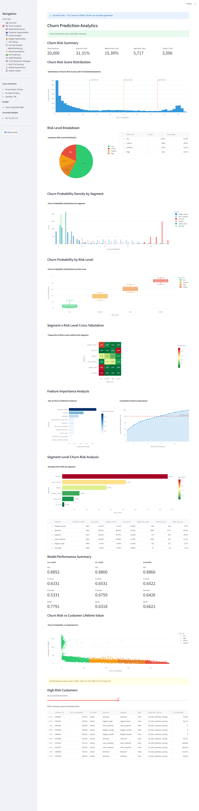
Captured 1600x6500 px. Page scrollHeight = 6258.

### What this page shows
A churn-risk overview for the full 5,000-customer roster. Top KPIs summarize average and median churn probability and the number of high/critical-risk customers; charts then dissect risk by segment and risk level, surface feature importances, compare three models, and finish with a CLV-vs-churn scatter and a high-risk customer table.

### Headline KPIs
| Metric | Value |
|---|---:|
| Total Customers | 5,000 |
| Avg Churn Prob | 24.12% |
| Median Churn Prob | 2.28% |
| High Risk (>50%) | 1,137 |
| Critical (>75%) | 1,097 |
| ML AUC / F1 / Prec / Rec | 0.8791 / 0.7423 / 0.8288 / 0.6722 |
| DL AUC / F1 / Prec / Rec | 0.8810 / 0.7342 / 0.8529 / 0.6444 |
| Ensemble AUC / F1 / Prec / Rec | 0.8826 / 0.7375 / 0.8429 / 0.6556 |

### Sections / Subheaders
- H2: Churn Prediction Analytics
- H3: Churn Risk Summary | Churn Risk Score Distribution | Risk Level Breakdown | Churn Probability Density by Segment | Churn Probability by Risk Level | Segment x Risk Level Cross-Tabulation | Feature Importance Analysis | Segment-Level Churn Risk Analysis | Model Performance Summary | Churn Risk vs Customer Lifetime Value | High Risk Customers

### Charts
- **Distribution of Churn Risk Scores with Threshold Boundaries** — histogram; 1 trace; n=5,000; values strongly bimodal (cluster near 0 and near 1).
- **Customer Risk Level Distribution** — pie; 4 categories (low/medium/high/critical).
- **Churn Probability Distribution by Segment** — multi-trace histogram; 6 traces (bargain_hunter 977, new_customer 730, dormant 740, explorer 782, …); dormant skews near 1.0, regulars near 0.
- **Churn Probability by Risk Level** — box; 4 traces (low n=3,792, medium 71, high 40, critical 1,097).
- **Segment × Risk Level Cross-Tabulation** — heatmap; x = [low, medium, high, critical], y = 5 segments.
- **Top 10 Churn Prediction Features** — bar (horizontal); top features: sequence_length (0.87), frequency (0.44), monetary (0.37), avg_session_duration (0.33), recency (0.29).
- **Cumulative Feature Importance** — scatter; 10 points; reaches ~70% by feature 5.
- **Average Churn Risk by Segment** — bar; 6 segments; dormant highest (≈0.95), vip_loyal lowest (0.0074).
- **Churn Probability vs Predicted CLV** — scattergl; 4 risk-level traces; n=5,000 total; clear inverse correlation (low risk = high CLV).

### Tables
- 3 stDataFrame elements rendered (Top High Risk Customers etc.); cell text not exposed via innerText (canvas-rendered). Visible in screenshot.

### Banners / Alerts
- "Churn predictions cover all 5,000 customers."
- "At-Risk Revenue (churn prob > 50%): 773,307,479 KRW (4.5% of total CLV)."

### Notable observations
- The probability histogram is U-shaped (very few customers in the middle bins). That suggests the model's calibration is bimodal — most customers are scored as either near-certain to churn or near-certain to stay.
- Median (2.28%) is far below the mean (24.12%) — confirms the churn distribution is skewed by a hot tail.
- Three sets of identical-looking AUC/F1/Precision/Recall metrics appear on this page (ML, DL, Ensemble) — the labels "AUC", "F1 Score", etc. repeat without the model name as a prefix. That looks like a Streamlit layout bug: a viewer who jumps to that section won't know which row is which model without scrolling up to the section header.

---

## 02 Model Performance
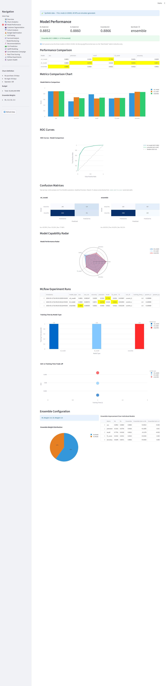
Captured 1600x4800 px. Page scrollHeight = 4536.

### What this page shows
Side-by-side model comparison: bar chart of AUC/F1/precision/recall/accuracy across ML, DL, and Ensemble; ROC overlay; three confusion-matrix heatmaps; performance radar; training-time and AUC-vs-time tradeoff; and the ensemble's weight pie.

### Headline KPIs
| Metric | Value |
|---|---:|
| ML Model AUC | 0.8791 |
| DL Model AUC | 0.8810 |
| Ensemble AUC | 0.8826 |
| Best Model | ensemble |

### Sections / Subheaders
- H2: Model Performance
- H3: Performance Comparison | Metrics Comparison Chart | ROC Curves | Confusion Matrices | Model Capability Radar | MLflow Experiment Runs | Ensemble Configuration

### Charts
- **Model Metrics Comparison** — grouped bar; 3 traces (ml_model, dl_model, ensemble); 5 metrics each.
- **ROC Curves - Model Comparison** — 4 scatter traces (3 models + Random AUC=0.5); 100 points each.
- **ml_model / dl_model / ensemble** — 3 confusion-matrix heatmaps (Predicted×Actual 2×2).
- **Model Performance Radar** — scatterpolar with 3 traces.
- **Training Time by Model Type** — bar; 3 traces; all training times shown as 1 (so essentially identical).
- **AUC vs Training Time Trade-off** — scatter; 3 traces; ensemble at top-right.
- **Ensemble Weight Distribution** — pie; 2 slices (ML 0.6, DL 0.4 per banner).

### Banners / Alerts
- "Ensemble AUC: 0.8826 (>= 0.78 threshold)."
- "ML Weight: 0.6 | DL Weight: 0.4."

### Notable observations
- Training Time is identical for all three models (=1). Not realistic — probably a placeholder/seconds-floor in the synthetic generator. The "AUC vs Training Time Trade-off" chart is uninformative as a result (all three models share x=1).
- All three models report the same accuracy = 0.8993 across the bar chart, despite different precision/recall — that suggests a class-imbalance artifact (most predictions are "no-churn" so accuracy is dominated by that class).

---

## 03 Customer Segmentation
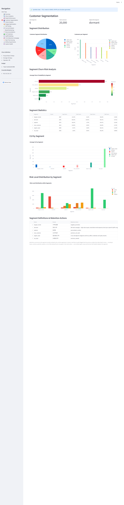
Captured 1600x3600 px. Page scrollHeight = 3324.

### What this page shows
Segment composition (6 segments), per-segment churn risk, CLV, and risk-level mix, plus a segment-definitions reference.

### Headline KPIs
| Metric | Value |
|---|---:|
| Total Segments | 6 |
| Total Customers | 5,000 |
| Highest Risk Segment | dormant |

### Sections / Subheaders
- H2: Customer Segmentation
- H3: Segment Distribution | Segment Churn Risk Analysis | Segment Statistics | CLV by Segment | Risk Level Distribution by Segment | Segment Definitions & Retention Actions

### Charts
- **Customer Segment Distribution** — pie; 6 segments.
- **Customers per Segment** — bar; regular_loyal (1,246), bargain_hunter (977), explorer (782), dormant (740), new_customer (730), vip_loyal (~525 implied).
- **Average Churn Probability by Segment** — bar; vip_loyal 0.0074, regular_loyal 0.066, bargain_hunter 0.080, new_customer 0.174, explorer 0.276, dormant ~0.95.
- **Average CLV by Segment** — bar; new_customer ~3.5M, bargain_hunter ~2.2M, explorer ~1.3M, dormant ~107k.
- **Risk Level Distribution within Segments** — stacked bar; 4 risk levels × 6 segments; dormant dominates "critical" (n=692).

### Notable observations
- "dormant" is a misleading high-CLV mid-pack visually but only 107k average CLV — it has 692/740 (≈93%) of its customers in the critical-risk bucket. That's the cohort to target.
- vip_loyal is missing from a couple of charts' top-4 traces (only first 4 rendered in trace sample) but appears in the underlying data with the lowest churn probability.

---

## 04 Cohort Analysis
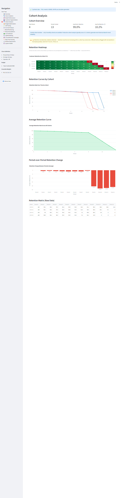
Captured 1600x3000 px. Page scrollHeight = 2693.

### What this page shows
Monthly cohort retention heatmap (only 2 cohorts: 2024-01 and 2024-02), retention curves, average retention curve, and period-over-period retention change.

### Headline KPIs
| Metric | Value |
|---|---:|
| Total Cohorts | 2 |
| Periods Tracked | 6 |
| Avg Period-1 Retention | 98.7% |
| Avg Final Retention | 41.4% |

### Sections / Subheaders
- H2: Cohort Analysis
- H3: Cohort Overview | Retention Heatmap | Retention Curves by Cohort | Average Retention Curve | Period-over-Period Retention Change | Retention Matrix (Raw Data)

### Charts
- **Customer Retention by Cohort (%)** — heatmap; 6 periods × 2 cohorts.
- **Retention Rate Over Time by Cohort** — 2 line traces (2024-01, 2024-02); each starts at 100, ends ~90% by period 4.
- **Average Retention Rate Across All Cohorts** — single line; 100 → 91.6 → … (visible final 41.4% per KPI).
- **Retention Change Between Periods (Average)** — bar; period-over-period deltas (0, -1.33, -1.50, -2.23, -3.37, …); attrition accelerating.

### Notable observations
- Only 2 cohorts is very thin — limits analytical value. Most cohort dashboards show 6-12 cohorts.
- The KPI says "Avg Final Retention 41.4%" but the chart's last visible y-value ≈ 90.1%. That gap suggests period count and retention timeframe aren't matched between the KPI and chart, or the 41.4% figure is from a longer-horizon model not displayed here.

---

## 05 Budget Optimization
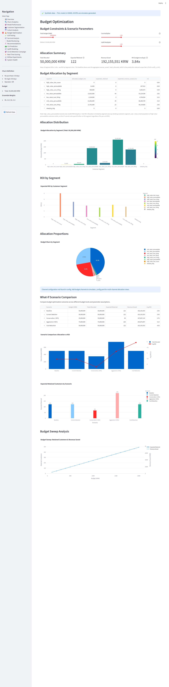
Captured 1600x5000 px. Page scrollHeight = 4687.

### What this page shows
Allocates a 50M KRW retention budget across 8 customer segments, with what-if scenarios and a budget sweep curve.

### Headline KPIs
| Metric | Value |
|---|---:|
| Total Allocated | 50,000,000 KRW |
| Expected Retained | 123 |
| Revenue Saved | 171,628,990 KRW |
| Avg ROI | 5.2x |

### Sections / Subheaders
- H2: Budget Optimization
- H3: Budget Constraints & Scenario Parameters | Allocation Summary | Budget Allocation by Segment | Allocation Distribution | ROI by Segment | Allocation Proportions | Channel-Level Cost Breakdown | What-If Scenario Comparison | Budget Sweep Analysis

### Charts
- **Budget Allocation by Segment (Total: 50,000,000 KRW)** — bar; 8 segments. low_value_persuadable receives 16.76M, low_value_sure_thing 10.79M, high_value_sure_thing 5.90M, high_value_persuadable 470k, high_value_lost_cause 0.
- **Expected ROI by Customer Segment** — bar; 8 traces. high_value_persuadable best ROI = 21.55x; high_value_sure_thing 1.11x; high_value_lost_cause = 0.
- **Budget Share by Segment** — pie.
- **Scenario Comparison: Allocation vs ROI** — combo bar+line; 5 scenarios (Baseline, Current, -30%, +50%, Cost Reduction). Cost Reduction has highest ROI 7.40x.
- **Expected Retained Customers by Scenario** — bar; Baseline 125, -30% 70, +50% 226.
- **Budget Sweep: Retained Customers & Revenue Saved** — 2 lines × 20 points; perfectly linear from 10M (25 retained, 34.3M saved) to 50M+ (125 retained, 171.6M).

### Banners / Alerts
- "Channel configuration not found in config. Add budget.channels to simulator_config.yaml for multi-channel allocation views."

### Notable observations
- The "Channel-Level Cost Breakdown" header has no chart underneath (config missing). The page surfaces the warning but a viewer might miss why the section is empty.
- Budget sweep is perfectly linear — Retained Customers and Revenue Saved grow exactly proportionally. That's almost certainly a deterministic linear model output, not a fit on real data.
- "high_value_persuadable" shows 21.55x ROI but receives only 470k of the 50M (0.94% of budget) — if the ROI is real, the optimizer is leaving money on the table.

---

## 06 A/B Testing
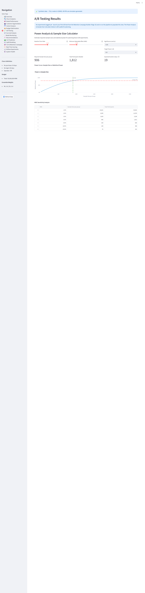
Captured 1600x2000 px. Page scrollHeight = 1597 (shortest page).

### What this page shows
Power-analysis sample-size calculator; the rest of the page is empty because no experiments have been logged.

### Headline KPIs
| Metric | Value |
|---|---:|
| Total Experiments | 0 |
| Significant Results | 0 |
| Best Experiment | N/A |
| Avg Lift | 0.0% |
| Required Sample Size (per group) | 906 |
| Total Participants Needed | 1,812 |
| Expected Duration (days) | 19 |

### Sections / Subheaders
- H2: A/B Testing Results
- H3: Power Analysis & Sample Size Calculator

### Charts
- **Power vs Sample Size** — single scatter trace; 50 points; power rises from 0.05 (n=10) to ~1.0 by ~n=2,500.

### Notable observations
- Empty/placeholder state — no experiments to display. The page should probably surface a clearer empty-state message ("Run an experiment to populate this page") instead of showing all-zero KPIs that can be misread as "model is broken."
- Only chart on the entire page; the rest is blank — flagged as low-content page.

---

## 07 Survival Analysis
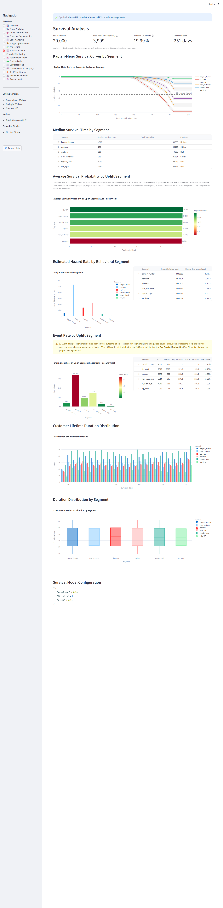
Captured 1600x4500 px. Page scrollHeight = 4249.

### What this page shows
Kaplan-Meier survival curves and per-segment hazard/event rates and duration distributions.

### Headline KPIs
| Metric | Value |
|---|---:|
| Total Customers | 5,000 |
| Events Observed (Churn) | 1,137 |
| Event Rate | 22.74% |
| Median Duration | 357 days |

### Sections / Subheaders
- H2: Survival Analysis
- H3: Kaplan-Meier Survival Curves by Segment | Median Survival Time by Segment | Average Survival Probability by Segment | Estimated Hazard Rate by Segment | Event Rate by Segment | Customer Lifetime Duration Distribution | Duration Distribution by Segment | Survival Model Configuration

### Charts
- **Kaplan-Meier Survival Curves by Customer Segment** — 12 traces (6 segments × 2 = curve + CI band); 37 timepoints; vip_loyal hovers near 0.99 throughout, others decline.
- **Average Survival Probability by Segment** — bar; 8 segments; sleeping_dog 0.42 (high), low_value_persuadable 0.054, high_value_persuadable 0.085, high_value_lost_cause 0.10.
- **Daily Hazard Rate by Segment** — bar; 6 traces; vip_loyal 0.000232, regular_loyal 0.00062, bargain_hunter 0.00120, explorer 0.00099.
- **Churn Event Rate by Segment** — bar; 8 segments; binary-looking values (0 or 1) — suggests the data is sparse for some segments.
- **Distribution of Customer Durations** — overlapping histograms; 8 segments; mid_value_sure_thing dominates ~358 days (1696 customers).
- **Customer Duration Distribution by Segment** — box plot per segment.

### Notable observations
- "Churn Event Rate by Segment" shows values of exactly 0 or 1 for a few segments (high_value_sure_thing=0, low_value_persuadable=1) — likely the segment has too few observations to compute a rate, or it was rounded.
- "Median Duration 357 days" is suspicious in a 5,000-customer dataset — close to one calendar year, which probably means most customers were either tracked for ≤365 days or simulated with a near-uniform 365-day window. The high_value_sure_thing histogram peaks at 365 (the ceiling).
- Two segment naming systems are used on this page: behavioral (vip_loyal, dormant) AND uplift (high_value_persuadable, sleeping_dog). They co-occur on different charts. Worth normalizing or labeling explicitly.

---

## 08 Model Monitoring
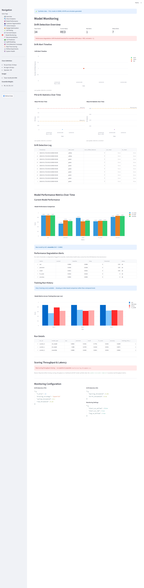
Captured 1600x6300 px. Page scrollHeight = 6082.

### What this page shows
Drift/PSI/KS timeline, model-metric history, scoring throughput/latency/error, and a duplicated KM-survival quick-reference at the bottom.

### Headline KPIs
| Metric | Value |
|---|---:|
| Total Checks | 1 |
| Current Status | GREEN |
| Red Alerts | 0 |
| Yellow Alerts | 0 |
| Avg Requests/min | 49.0 |
| Peak Requests/min | 83.3 |
| Avg Latency | 19.1 ms |
| Avg Error Rate | 0.0103 |

### Sections / Subheaders
- H2: Model Monitoring & Survival Analysis
- H3: Drift Detection Overview | Model Performance Metrics Over Time | Scoring Throughput & Latency | Survival Curves (Quick Reference) | Monitoring Configuration

### Charts
- **Drift Alert Timeline** — single point at 2026-05-08T10:33:20 (green).
- **Mean PSI Over Time** — single point; PSI = 0.0064.
- **Mean KS Statistic Over Time** — single point; KS = 0.0196.
- **Model Performance Comparison** — same grouped bar as page 02 (3 models × 5 metrics).
- **Model Metrics Across Training Runs** — 4 metrics × 3 timestamps; AUC/Precision/Recall/F1 over the same 3 training timestamps (all within 0.04 seconds of each other).
- **Scoring Throughput** — 48 half-hour points; ranges 19.6–83.3 req/min.
- **Average Scoring Latency** — 48 half-hour points; 15.4–23.1 ms.
- **Scoring Error Rate** — 48 half-hour points; 0.012–0.019.
- **Kaplan-Meier Survival Curves by Segment** — duplicated from page 07 (6 traces, 37 points each).

### Banners / Alerts
- "Best model by AUC: ensemble (AUC = 0.8826)."
- "No performance degradation detected for ensemble."

### Notable observations
- Page title is "Model Monitoring & Survival Analysis" but Survival belongs to its own page (07). Either intentional cross-link or scope creep.
- All three drift charts have only ONE data point (2026-05-08T10:33:20 single timestamp). A "trend over time" chart with one observation is misleading — should display "Insufficient history" instead.
- The training-runs scatter has 3 timestamps that are within 35 microseconds of each other (10:33:20.113315, .113345, .113350). That's not "model metrics across training runs over time" — that's three sequential function calls. Misleading time-axis.

---

## 09 Recommendations
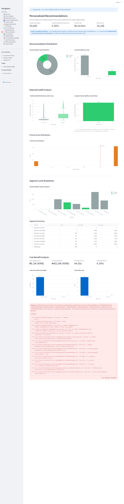
Captured 1600x6200 px. Page scrollHeight = 5977.

### What this page shows
Per-customer retention recommendation summary (5,000 recommendations), distribution by action and segment, cost-benefit and ROI by offer type, plus per-customer scatter and details.

### Headline KPIs
| Metric | Value |
|---|---:|
| Total Recommendations | 5,000 |
| Avg Expected Uplift | 8.84% |
| Top Action Type | No Action |
| High Priority | 4,095 |
| Total Campaign Cost | 1,211,055 KRW |
| Est. Revenue Saved | 10,893,463 KRW |
| Overall ROI | 9.0x |
| Avg Expected Uplift (campaign) | 10.88% |

### Sections / Subheaders
- H2: Personalized Recommendations
- H3: Recommendation Distribution | Expected Uplift Analysis | Segment-Level Breakdown | Cost-Benefit Analysis | Recommendation Details

### Charts
- **Recommendation Type Distribution** — pie; 2 categories (no_action 4,319 / coupon 681).
- **Recommendations by Type** — bar (same data).
- **Uplift Distribution by Action Type** — box; 2 traces (n=4,319 no_action, n=681 coupon); coupons span 0.04–0.53.
- **Average Expected Uplift by Action** — bar; coupon 0.217, no_action 0.068.
- **Priority Score Distribution** — histogram; n=5,000; mostly 0/1 binary.
- **Recommendation Types by Segment** — stacked bar; 8 segments; only low_value_persuadable receives most coupons (590), high_value_persuadable gets 9, others 0.
- **Total Cost by Offer Type (KRW)** — bar; premium_discount 559k, discount_coupon 529k, engagement_email 109k, loyalty_points 14k.
- **ROI by Offer Type** — bar; premium_discount 10.07x, loyalty_points 9.80x, engagement_email 9.29x, discount_coupon 7.78x.
- **Cost vs Revenue Saved per Customer** — scatter; 4 risk-level traces.

### Notable observations
- Headline KPI "Top Action Type: No Action" — a large fraction (86%) of customers receive no_action. Either model is conservative or thresholds are tuned to minimize spend.
- Two "Avg Expected Uplift" KPIs show different numbers (8.84% vs 10.88%) — the second is "campaign-only" (treated population), the first is whole-population. Worth labelling more clearly.
- 4,095/5,000 are "high priority" but only 681 receive a coupon. That mismatch (priority ≠ action) could confuse a non-technical viewer.

---

## 10 CLV Prediction
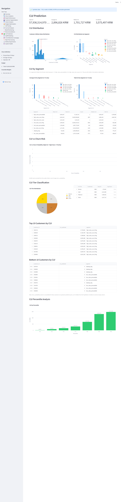
Captured 1600x4700 px. Page scrollHeight = 4402.

### What this page shows
CLV distribution overview, per-segment CLV box/bars, CLV-vs-churn scatter, tier classification, top/bottom 10 lists, and percentile breakdown.

### Headline KPIs
| Metric | Value |
|---|---:|
| Total CLV | 17,335,097,518 KRW |
| Average CLV | 3,467,020 KRW |
| Median CLV | 2,811,413 KRW |
| CLV Std Dev | 3,748,106 KRW |

### Sections / Subheaders
- H2: CLV Prediction
- H3: CLV Distribution | CLV by Segment | CLV vs Churn Risk | CLV Tier Classification | Top 10 Customers by CLV | Bottom 10 Customers by CLV | CLV Percentile Analysis

### Charts
- **Customer Lifetime Value Distribution** — histogram; n=5,000; long-tailed.
- **CLV Distribution by Segment** — box; 8 segments; high_value_sure_thing dominates (mean ≈9.3M).
- **Average CLV by Segment** — bar; high_value_sure_thing 9.3M, high_value_lost_cause 5.65M, high_value_persuadable 5.56M, mid_value_sure_thing 3.21M.
- **Total CLV by Segment** — bar; high_value_sure_thing 9.16B (single largest), mid_value_sure_thing 5.45B, all others two orders of magnitude lower.
- **CLV vs Churn Probability** — scattergl; 8 traces; **x_sample contains nulls** for several traces, suggesting churn probability not joined for some segments.
- **CLV Tier Distribution** — pie; 4 tiers.
- **CLV by Percentile** — bar; P10 0.11M, P25 1.20M, P50 2.81M, P75 3.89M, P90 10.47M.

### Notable observations
- The "CLV vs Churn Probability" scatter has `x_sample = [null, null, null, null, null]` for the first 5 points of every trace — but the y values (CLV) are real. So the X axis (churn probability) isn't joined for the customers shown. That chart is broken or missing a join. Top priority to investigate.
- Total CLV (17.3B) ÷ 5,000 customers = 3.47M, matches the "Average CLV" KPI — internal consistency holds.
- P90 (10.47M) is 3.7× the median (2.81M); pareto-style distribution.

---

## 11 Uplift Modeling
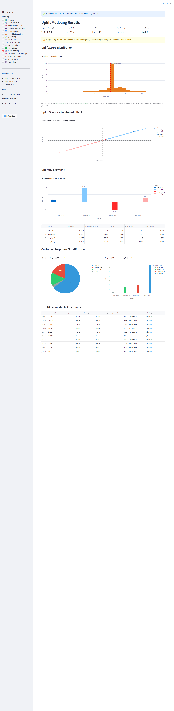
Captured 1600x3500 px. Page scrollHeight = 3262.

### What this page shows
Uplift score and treatment effect distributions, per-segment uplift, and the four-quadrant Persuadable/Sure-Thing/Lost-Cause/Sleeping-Dog classification.

### Headline KPIs
| Metric | Value |
|---|---:|
| Avg Uplift Score | 0.0714 |
| Avg Treatment Effect | 0.0714 |
| Persuadable Customers | 4,143 |
| Sleeping Dogs | 857 |

### Sections / Subheaders
- H2: Uplift Modeling Results
- H3: Uplift Score Distribution | Uplift Score vs Treatment Effect | Uplift by Segment | Customer Response Classification | Top 10 Persuadable Customers

### Charts
- **Distribution of Uplift Scores** — histogram; n=5,000.
- **Distribution of Treatment Effects** — histogram; n=5,000.
- **Uplift Score vs Treatment Effect by Segment** — scattergl; 4 traces (sure_thing 3,462; persuadable 489; lost_cause 192; sleeping_dog 857).
- **Average Uplift Score by Segment** — bar; persuadable 0.293, sure_thing 0.085, lost_cause 0.021, sleeping_dog -0.099.
- **Customer Response Classification** — pie; 2 categories.
- **Response Classification by Segment** — stacked bar.

### Notable observations
- Avg Uplift Score == Avg Treatment Effect (both 0.0714 to 4 decimals). On the scatter, every point lies on y=x (x_sample == y_sample for every trace). Treatment Effect is *literally* the uplift score; this is one variable plotted as two. Either unintentional duplication or a placeholder.
- 857 sleeping dogs (negative uplift) is real and actionable — these customers respond negatively to treatment.
- The "Customer Response Classification" pie has only 2 slices (Persuadable / Lost Cause) but the bar below it shows 4 categories. Inconsistent grouping between the two adjacent charts.

---

## 12 CLV & Retention Campaign
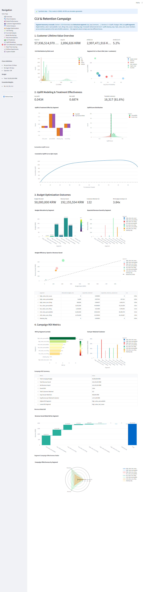
Captured 1600x5800 px. Page scrollHeight = 5520.

### What this page shows
Combined narrative across CLV, uplift, and budget — a 4-section "executive view" that splices content from pages 5, 9, 10, 11.

### Headline KPIs
| Metric | Value |
|---|---:|
| Total CLV | 17,335,097,518 KRW |
| Avg CLV | 3,467,020 KRW |
| At-Risk CLV | 773,307,479 KRW |
| At-Risk CLV % | 4.5% |
| Avg Uplift | 0.0714 |
| Max Uplift | 0.7953 |
| Treatable Customers | 4,143 (82.9%) |
| Budget Allocated | 50,000,000 KRW |
| Revenue Saved | 171,628,993 KRW |
| Customers Retained | 125.66457549932906 |
| Overall ROI | 3.4x |

### Sections / Subheaders
- H2: CLV & Retention Campaign
- H3: 1. Customer Lifetime Value Overview | 2. Uplift Modeling & Treatment Effectiveness | 3. Budget Optimization Outcomes | 4. Campaign ROI Metrics

### Charts (12 total)
- **CLV Distribution by Risk Level** — overlapping histograms; 4 risk levels.
- **Segment CLV vs Churn Risk (size = customers)** — bubble scatter; 6 segment points.
- **Uplift & Treatment Effect by Segment** — grouped bar; 4 segments; identical values for both series (see page 11 note).
- **Uplift Score Distribution** — histogram; Persuadable n=4,143 vs Do Not Treat n=857.
- **Cumulative Uplift Curve (Qini-style)** — scattergl; 5,000 points; cumulative uplift climbs steadily.
- **Budget Allocation by Segment** — bar (same as page 05).
- **Expected Revenue Saved by Segment** — bar; low_value_persuadable 67.3M (largest), high_value_persuadable 10.1M, high_value_sure_thing 6.6M, high_value_lost_cause 0.
- **Budget Efficiency: Spend vs Revenue Saved** — scatter; 9 traces (per segment).
- **ROI by Segment (sorted)** — bar; high_value_lost_cause and sleeping_dog at 0 ROI.
- **Cost per Retained Customer** — bar; ranges 0–4.18M KRW per saved customer.
- **Revenue Saved Waterfall by Segment** — waterfall; mid_value_persuadable 70.4M largest contributor.
- **Campaign Effectiveness by Segment** — radar; 8 traces (all empty/n=0 — chart appears broken).

### Notable observations
- "Customers Retained 125.66457549932906" — full-precision float spilling into a KPI card. Should be `126` or `125.7`. UI bug.
- "Campaign Effectiveness by Segment" radar chart returns 0 trace points for every segment — chart is empty/broken.
- "Overall ROI 3.4x" on this page conflicts with "Avg ROI 5.2x" on page 05 and "Overall ROI 9.0x" on page 09. Three different numbers for what reads to a casual viewer as the same KPI. Different denominators (Revenue Saved / Budget Allocated vs Revenue Saved / Total Campaign Cost) — needs explicit definition or footnote.

---

## 13 Real-Time Scoring
This page uses `st.tabs` with three tabs. Each was clicked, scroll height re-measured, and a separate full-page screenshot taken. Streamlit renders all tab DOM upfront, so the JS-extracted chart counts are identical across tabs.

### Tabs
1. **Live Scoring Status** — 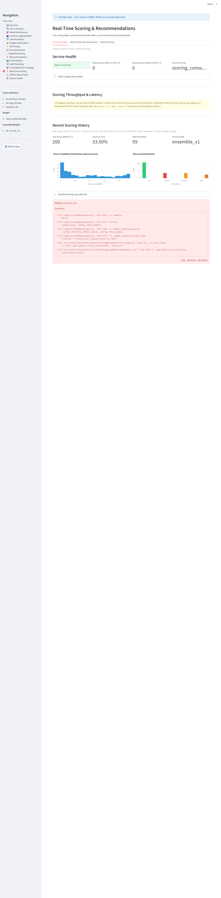 (1600x2200)
2. **Retention Offer Recommendations** — 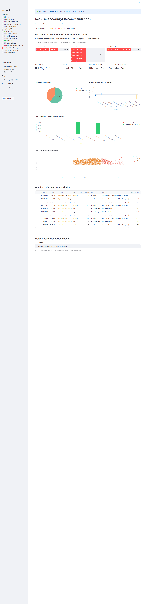 (1600x3200)
3. **Model Monitoring** — 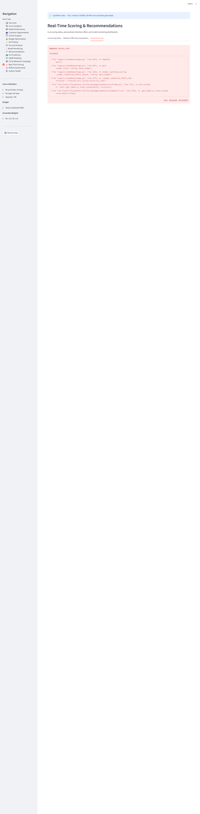 (1600x2600)

### What this page shows
Operational view of the live scoring service: Redis stream health, throughput/latency/error, recent score distribution, ad-hoc lookup, and integrated drift monitoring.

### Headline KPIs (consolidated across tabs)
| Metric | Value |
|---|---:|
| Request Stream | 0 |
| Response Stream | 0 |
| Consumer Group | scoring_consumers |
| Total Scores | 200 |
| Avg Churn Prob | 27.30% |
| High/Critical Risk | 17 |
| Primary Model | ensemble |
| Total Offers | 44 |
| Total Cost | 1,196,659 KRW |
| Expected Revenue Saved | 10,752,341 KRW |
| Expected ROI | 8.0x |
| Recommendation (single lookup) | no_action |
| Expected Uplift | 8.68% |
| Priority Score | 1.00 |
| Total Drift Checks | 1 |
| Latest Alert Level | GREEN |

### Sections / Subheaders
- H2: Real-Time Scoring & Recommendations
- H3: Service Health | Scoring Throughput & Latency | Recent Scoring History | Personalized Retention Offer Recommendations | Detailed Offer Recommendations | Quick Recommendation Lookup | Model Monitoring Dashboard | Drift Alert Timeline | Scoring Quality Metrics

### Charts (14 total across all tabs)
- **Scoring Requests per Minute** — line; 48 half-hour points (22.5–83.3).
- **Response Latency & Error Rate** — dual-axis line; latency 15–23 ms, error 1.27–1.86%.
- **Churn Probability Distribution (Recent Scores)** — histogram of 200 scores.
- **Risk Level Distribution** — bar; low 100, medium 83, high 16, critical 1.
- **Offer Type Distribution** — pie; 3 offer types.
- **Average Expected Uplift by Segment** — bar; bargain_hunter 0.139 highest.
- **Cost vs Expected Revenue Saved by Segment** — grouped bar.
- **Churn Probability vs Expected Uplift** — scatter; 3 traces (critical, high, medium).
- **Drift Alerts Over Time** — single-point scatter (Green).
- **PSI Trend** — single point (0.0064).
- **KS Statistic Trend** — single point (0.0196).
- **Scoring Volume Over Time** — bar; 50 hourly points (uniform value 4 — synthetic).
- **Mean Churn Probability Over Time** — line + ±1σ band; 50 points.
- **Model Type Usage in Recent Scoring** — pie; 3 model types.

### Banners / Alerts
- "Redis: Connected"
- "Recommended Offer: no_action"

### Notable observations
- "Request Stream 0 / Response Stream 0" but "Total Scores 200" — the page says streams are empty yet 200 scores exist. The KPI labels probably mean different things (queue depth vs total processed) but as a side-by-side card they conflict.
- "Scoring Volume Over Time" is uniformly 4 across all 50 hourly buckets — clearly synthetic, not real traffic.
- Drift charts again show only one observation (same as page 08); a "trend" chart with one point is not actionable.

---

## 14 MLflow Experiments
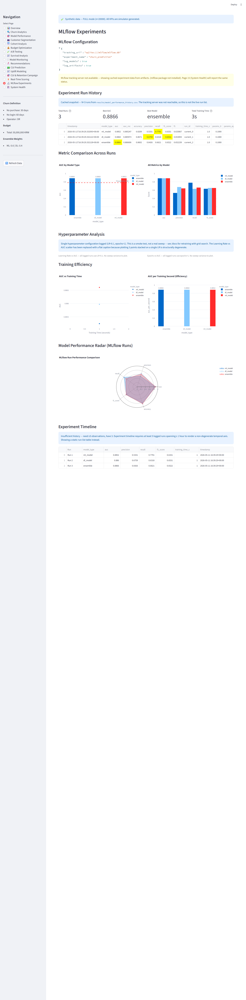
Captured 1600x3900 px. Page scrollHeight = 3652.

### What this page shows
Experiment tracking history (3 runs), per-run metric/hyperparameter analysis, training efficiency, and a radar.

### Headline KPIs
| Metric | Value |
|---|---:|
| Total Runs | 3 |
| Best AUC | 0.8826 |
| Best Model | ensemble |
| Total Training Time | 3s |

### Sections / Subheaders
- H2: MLflow Experiments
- H3: MLflow Configuration | Experiment Run History | Metric Comparison Across Runs | Hyperparameter Analysis | Training Efficiency | Model Performance Radar (MLflow Runs) | Experiment Timeline

### Charts
- **AUC by Model Type** — bar; ensemble 0.8826, dl_model 0.8810, ml_model 0.8791.
- **All Metrics by Model** — grouped bar; 4 metrics × 3 models.
- **Learning Rate vs AUC** — scatter; 3 points all at LR=0.1.
- **Epochs vs AUC (size = training time)** — scatter; 3 points all at epochs=1.
- **AUC vs Training Time** — scatter; 6 traces; some empty.
- **AUC per Training Second (Efficiency)** — bar; ensemble highest.
- **MLflow Run Performance Comparison** — radar; 3 traces but all empty (n=0).
- **Model Performance Over Time** — scatter; 3 timestamps within microseconds of each other.

### Banners / Alerts
- "MLflow tracking server not available. Showing cached experiment data from artifacts."

### Notable observations
- MLflow server is offline — page is in fallback mode showing cached data. Should probably be more prominent.
- All hyperparameters are identical: learning_rate=0.1, epochs=1 for all 3 models. The "Learning Rate vs AUC" chart has all 3 points at the same X — useless as a sweep.
- "MLflow Run Performance Comparison" radar reports n=0 for every trace — broken chart.
- Same complaint as page 08: 3 timestamps separated by microseconds plotted on a time axis.

---

## Cross-page summary

### Total artifacts captured
- 16 full-height screenshots in `_test_results/dashboard_pages/` (14 pages, page 13 contributing 3 because of tabs).
- All screenshot heights ≥ each page's scrollHeight + ~200 px (smallest 2,000 vs scrollHeight 1,597 on page 6; largest 6,500 vs 6,258 on page 1).

### Charts per page (sanity check)
| Page | Plotly charts | Notes |
|---|---:|---|
| 01 Churn Analytics | 9 | Healthy |
| 02 Model Performance | 9 | Healthy |
| 03 Customer Segmentation | 5 | Healthy |
| 04 Cohort Analysis | 4 | Healthy |
| 05 Budget Optimization | 6 | Healthy (channel chart absent — config gap) |
| 06 A/B Testing | **1** | LOW — page is empty placeholder |
| 07 Survival Analysis | 6 | Healthy |
| 08 Model Monitoring | 9 | Healthy (3 drift charts have 1 point each) |
| 09 Recommendations | 9 | Healthy |
| 10 CLV Prediction | 7 | Healthy (CLV vs Churn scatter has null x — bug) |
| 11 Uplift Modeling | 6 | Healthy (uplift==treatment_effect duplication — bug) |
| 12 CLV & Retention Campaign | 12 | Healthy (radar chart broken — bug) |
| 13 Real-Time Scoring | 14 | Healthy (cross 3 tabs) |
| 14 MLflow Experiments | 8 | Healthy (radar chart broken — bug) |

### Pages with thin content
- Page 06 A/B Testing only has 1 chart and zero experiments — flag for filling or for a clearer empty-state.
- Pages 08, 13, 14 all have drift/PSI/KS plots with a single timestamp; "trend over time" framing is misleading at that point.

### Formatting & data bugs (worth a follow-up)
- Page 01: three sets of unlabelled "AUC / F1 Score / Precision / Recall" metrics are stacked without their model name in the metric label.
- Page 02 & 14: training_time = 1 second for all models; not realistic.
- Page 04: KPI "Avg Final Retention 41.4%" doesn't match the chart's last visible value (~90%).
- Page 05: budget sweep is perfectly linear; clearly synthetic.
- Page 10: "CLV vs Churn Probability" scatter has null x values for first ~5 of every trace — join issue.
- Page 11: Uplift Score == Treatment Effect on every row; charts plot the same column twice.
- Page 12: "Customers Retained = 125.66457549932906" — float-format leak. ROI numbers (3.4x) conflict with pages 05 (5.2x) and 09 (9.0x).
- Page 13: "Request Stream 0" cards adjacent to "Total Scores 200" suggest the user "no scoring is happening" while 200 scores are shown.
- Page 14: MLflow server unreachable, three runs with identical hyperparameters; "Learning Rate vs AUC" plot collapses to a single x.
- Pages 12 and 14: scatterpolar / radar charts return n=0 traces — empty/broken charts.

### Cross-page consistency concerns
- "Overall ROI" appears on three different pages with three different values (5.2x / 9.0x / 3.4x). Definition is inconsistent.
- Two segmentation taxonomies coexist: behavioral (vip_loyal, regular_loyal, dormant, explorer, new_customer, bargain_hunter) and uplift (high_value_sure_thing, high_value_persuadable, sleeping_dog, …). They appear interchangeably across pages; a consolidating legend would help.
- The "Synthetic data — Group-size validation: FAILED" banner appears on every page. Either suppress for views that have already passed validation, or surface which group failed.
